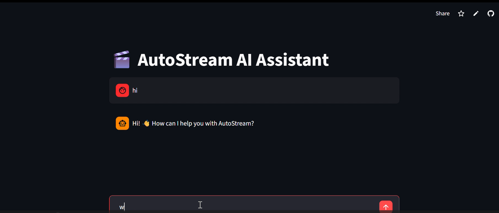
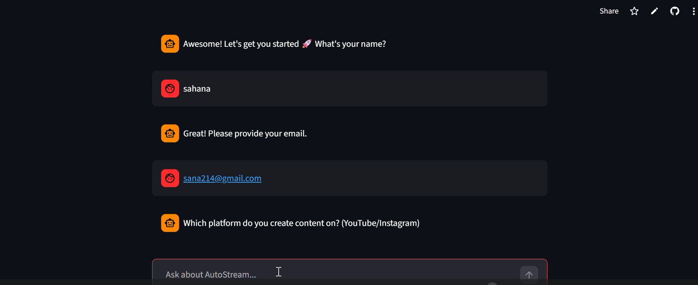
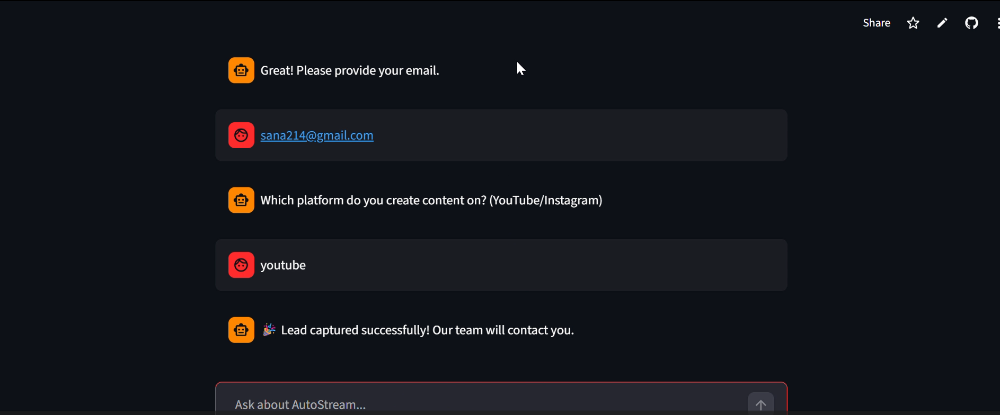

# 🎬 AutoStream AI Assistant

An AI-powered conversational assistant built with Streamlit and LangChain that helps users explore AutoStream pricing, plans, and features while capturing high-intent leads automatically.

---

## 🚀 Features

- 💬 Interactive AI Chat Assistant
- 🧠 Intent Detection System
- 📋 Auto Lead Capture Workflow
- 🔎 Pricing & Plan Information Retrieval
- 🗂 Conversation Memory using LangChain
- ⚡ Built with Streamlit Chat UI

---

## 🛠 Tech Stack

- Python
- Streamlit
- LangChain
- Conversational Memory
- Rule-Based Intent Detection

---
## 📦 Requirements

```txt
streamlit
langchain==0.2.17

## 📂 Project Structure

```text
├── app.py
├── agent.py
├── rag.py
├── state.py
├── tools.py
└── README.md
```
## OUTPUT SCREENSHOTS








Demo Video

https://github.com/user-attachments/assets/5be250d2-eff7-472a-b8b8-fa2ab0c0bc87


